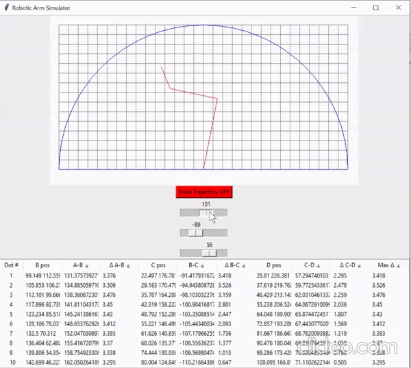
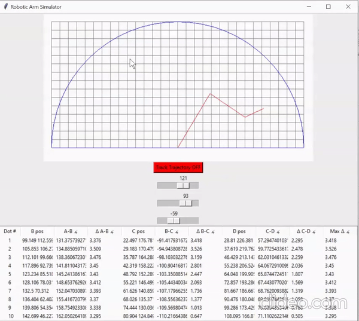
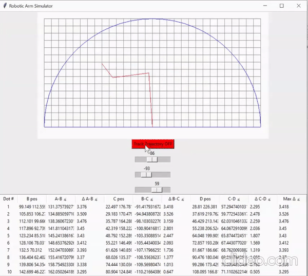

# Getting started

This repository contains all the files required to build and run the robotic arm simulator

* `src`: contains the classes and helper functions to implement the app
* `src/canvas_helper.py`: contains the helper functions to render graphics
* `src/robot.py`: python class for the robotic arm
* `assets`: figures for README
* `run.py`: the executable python file to run the app
* `setup.py`: containts scipts to make the python Tkinter to a Windows executable .exe file.
* `build`: built Windoes executable folder

To simply run the app on Windows, clone or download the repo and open `build/exe.win-amd64-3.9/run.exe`.


# Functions

## Sliders
The feautre of sliders allows you to choose the angle of each robotic arm, and adjust freely to interact with the simulator.


## Click to Move
Click anywhere inside of the reachable area to move the robotic arm to different places!


## Trajectory Mode & Statistics Table
Click on the Trajectory Mode button to enable trajectory mode. In Trajectory mode, you can watch how the robotic arm moves from one point to the other.

Once in trajectory mode, while the arm is moving, the positional data is recorded why the arm is moving. The trajectory is recorded including the positional change, angle changes, and the maximum angle change among all.



# Algorithms Explained
## Direct map from angles to UI
To map the angles on the slider, I mainly used trignometry to calculate each position of the points starting from origin. Specifically, Using cos and sin functions, I can calculate the relative x,y positions from the current point to the next point.
```
# Calculate x and y coordinates of each point
x_b = 320-150 * math.cos(angle1)
y_b = 320-150 * math.sin(angle1)
x_c = x_b - 100 * math.cos(angle1 + angle2)
y_c = y_b - 100 * math.sin(angle1 + angle2)
x_d = x_c - 50 * math.cos(angle1 + angle2 + angle3)
y_d = y_c - 50 * math.sin(angle1 + angle2 + angle3)
```
320 is used for calibration since the coordinate system of the tkinter is different from the ideal coordinate system.

## Reverse map from the click point (end point D)
Inside of `src/robot.py`, The `direct_move` method captures this functionality.
Mainly, I used a shortcutting method which requires me to only calculate a triangular postioning. The shortcutting can be described as follows:
```
Connect A to D, align CD to be on the line of AD. Depending on the position of the clickpoint (D), the alignment of CD and either point inwards toward the origin (A) or outwards away from A.

After this, bothg position A, C and D is fixed, I would only need to find the position of B. Now, given the length of AB, BC, and CD, we can easily find the angles of the triangle formed by A, B, and C, using the law of cosines.

For the specific conditions, see the specifics in robot.py.
```

## Trajectory map
Inside of `src/robot.py`, The `move_in_trajectory` method captures this functionality.
With the above methods implemented, we then have functions that map: angles --> positions, positions --> angles. Therefore,
to find the trajectory, we can simply cut 21 evenly spaced points in between the line DD'. 
Call the functions as follows:

```
21_positions = [...]

for i in 1...21:
    direct_move(21_positions[i])

    # wait for 0.25 seconds

    # record the statistics and put in table

direct_move(final position)
```


# Environment setup
This is only meant if you want to further experiment or improve the simulator.

```
---python 3.8---
pip install tk (if needed; should be installed by default)

---In your terminal at the project root directory, run:---
python run.py
```
